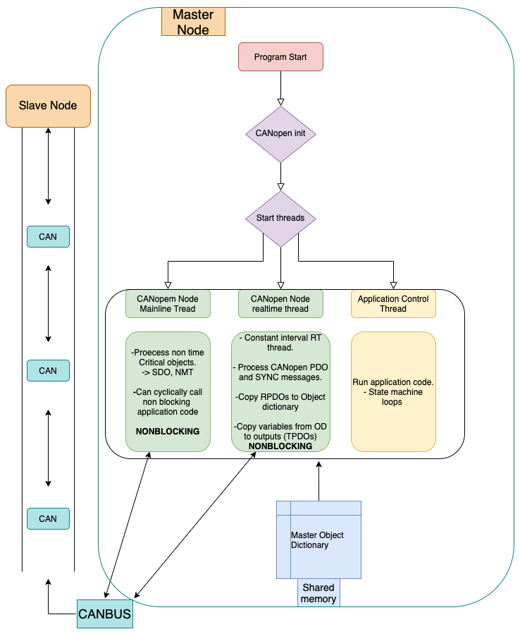

# Flowchart of a typical CORC implementation

# Multi threaded execution

To run application tasks and network tasks (all CANopen acticity and messaging) the software runs threee parallel threads. Two threads to maintain up to date CANopen processes and a third running the applications program loop.

## CANopenNode threads

Using the CANopenNode framework, CORC runs both a mainline thread for executing time consuming CANopen opperations (SDO messaging,Heartbeat, LSS, etc.) and a "realtime" thread for time critical CANopen opperations (PDO and SYNC messaging), running at a constant interval (typically 1ms).

For more details on the implementation of CANopenNode please go to the projects github and documentation [page](https://github.com/CANopenNode/CANopenNode).

# Application thread

The applications loop speed can be altered by the programmer, however it must run slower then the CANopen Node rt loop. This insures any PDO reliante commands to nodes from the application are processed and sent out on the bus.

<!-- \todo: test and document accurte method for max and min program loop speed plus associated issues when approaching max (jitter etc.)-->
