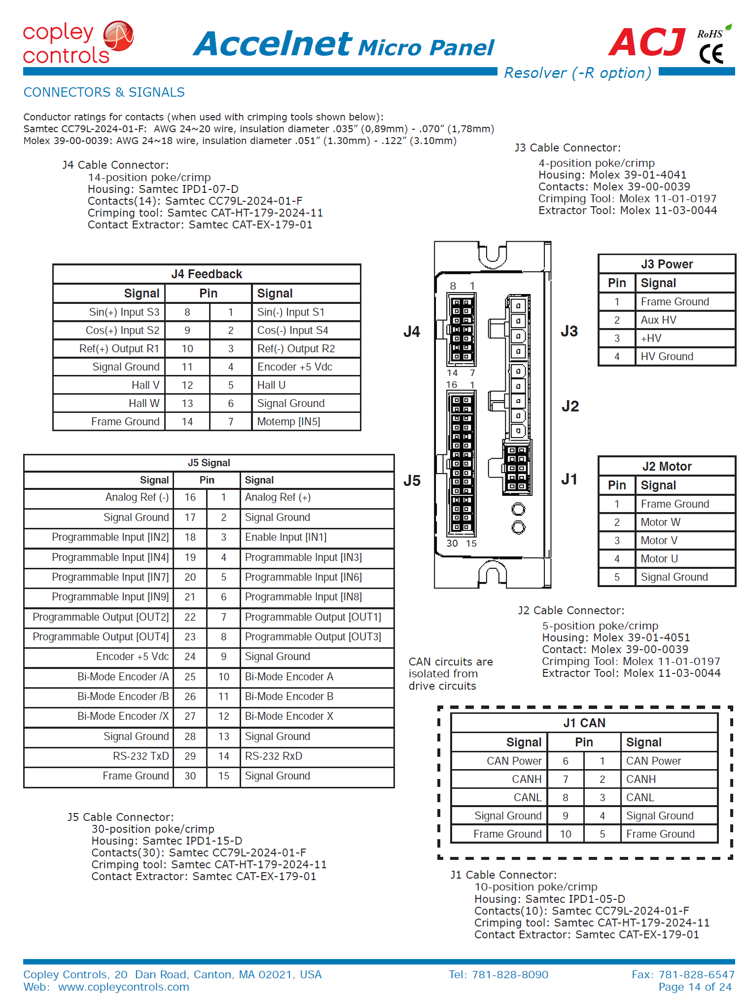

# Motor Drive Configuration and CANbus Wiring

This page has information about connecting to the the Accelnet Motor drives on the X2 using serial connection. The 2nd half of the page has instructions of wiring the CANbus network to the motor drives.

The Fourier X2 exoskeleton currently uses the Accelnet [ACJ-055-18](https://www.copleycontrols.com/en/products/acj-055-18) servo drives. These support the CANopen protocol. 

## USB-Serial Adapter (TRP-C08) to Motor Drive
We cannot use this CANbus to communicate to the drive directly from a PC (unless you get a CANbus adapter). Communicating directly from the PC is useful for configuring the drive (eg. allocating CAN node ID) and troubleshooting. We use serial comms for this, specifically RS232. 

The Accelnet [datasheet](https://www.copleycontrols.com/wp-content/uploads/2018/02/Accelnet_Micro_Panel_CANopen-ACJ-Datasheet-Datasheet.pdf) recommends using ACJ-SK cable kit for serial comms. However, for our testing we have used a [TRP-C08](http://www.trycom.com.tw/TRP-C08.htm) USB-Serial adapter. Unfortunately, the unit we have uses a discontinued chipset and current drivers throw an error. Below are steps to rectify this.

1. Plug in the TRP-C08 to your PC. On Windows 10, this automatically installs the latest drivers. These can also be found [here](http://www.trycom.com.tw/DOWNLOAD.htm). 
2. The drivers from step 1 are incompatible. To fix it, go [here](http://www.ifamilysoftware.com/news37.html) and download the "PL2303_64bit_ Installer.exe" and install it. Run the installed software and follow the instructions to fix the driver.

Now that the serial adapter is setup, you can connect it to the motor drive and configure it as shown below.

## Accelnet CME Configuration Using Serial
1. Connect the pins from the serial adapter to the Accelnet drive as shown below. 
    
    | Serial Adapter| ACJ-055-18 Servo Drive|
    | ------------- |:----------------------:|
    | TXD           | RXD on J5              |
    | RXD           | TXD on J5              |
    | GND           | Signal Ground on J5    |

3. Download and install the [CME2](https://www.copleycontrols.com/en/products/acj-055-18/) software from Copley.
4. Run the CME2 software. Start the "communications wizard > Serial" and select the COM port on which the serial adapter is connected. You can check the COM port by going to "device manager > ports" in Windows. You may need to set the serial adapter bitrate to match CME software detected bitrate. The bit rate can be selected from properties of the TRP-C08 in "device manager > ports".
5. If all the previous steps succeeded, the CME2 software will connect to the amplifier (Accelnet drive). You should now be able to modify the settings of the drive and troubleshoot. See the help under the CME software for more details. 

Now you can configure the drives as per the CME manual.
 ---
# CANbus wiring for BBB and Accelnet
Image below shows the wiring required to connect the Accelnet motor drive to a BBB (2 node CANbus network). For more nodes, the network is basically daisy chained. And the network has to be terminated with 120 ohm resistances. For more info, read [this](https://tekeye.uk/automotive/can-bus-cable-wiring).

Note, that the BBB comms cape already has a 120 ohm terminating resistance.

### Accelnet ACJ-055-18 Pins
Pin mapping from Accelnet [datasheet](https://www.copleycontrols.com/wp-content/uploads/2018/02/Accelnet_Micro_Panel_CANopen-ACJ-Datasheet-Datasheet.pdf).

For J1, power pins (1 and 6) and internally connected. So are signal GND pins (4 and  9). So you can connect power and ground to either of these sets of pins. 