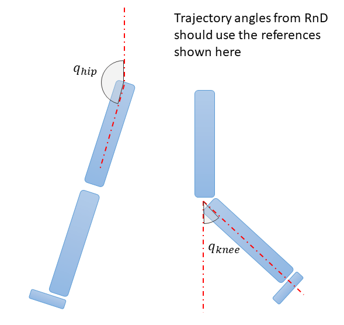
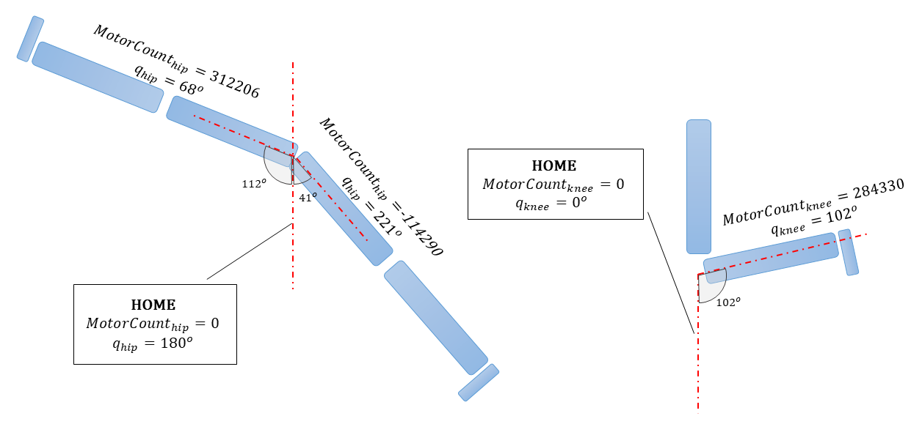

# Calibrating and Homing the X2

The X2 has a gear ratio of 122.5 and the counts per revolution is 4096. There is an additional multiplier x2 in the CANopen implementation. This means, a full revolution is 122.5 x 4096 x 2 = 1003520 counts. The commands issued to the X2 drive must be in counts. 

The figure below shows the reference for joint angles.

The figure below shows the range of motion of the joints and their corresponding motor count values (assuming it has been homed to straight position).

Using the y=Ax+B where A=(y2-y1)/(x2-x1) and B=(y1x2-y2x1)/(x2-x1), we can find a relation between q values and motor count values. y is the motor count and x is the q value. 

The table below shows some valid configurations.

| Motor Count hip (y)  | qhip (x)  |
| -------------------- |:---------:|
| 250880               | 90        |
| 0                    | 180       |

| Motor Count knee (y) | qknee (x) |
| -------------------- |:---------:|
| 250880               | 90        |
| 0                    | 0         |

