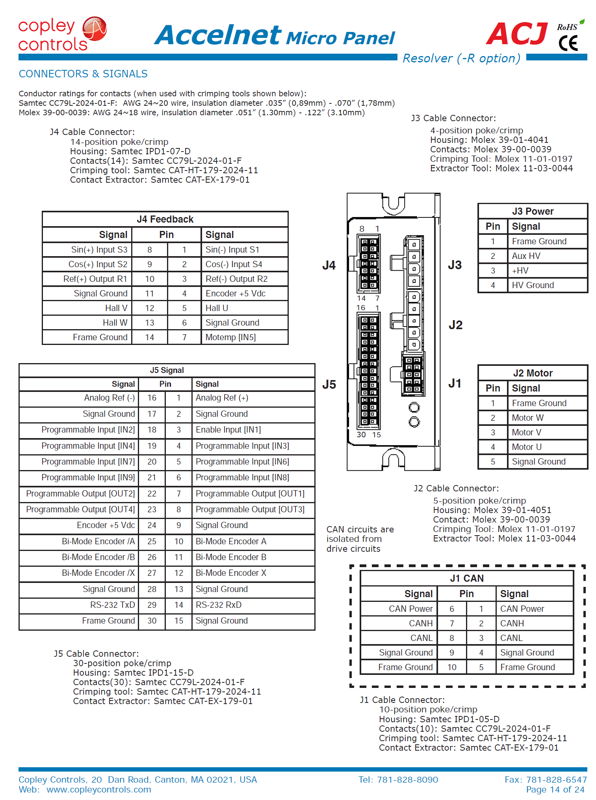

**This section contains features that are currently in development and not fully tested/documented. They are recorded here for reference.**
## CANbus
The Fourier X2 exoskelton currently uses the Accelnet [ACJ-055-18](https://www.copleycontrols.com/en/products/acj-055-18) servo drivers. These support the CANopen protocol. We use BeagleBoneBlack with a [comms cape](https://github.com/beagleboard/capes/tree/master/beaglebone/Comms) for communicating with it. BBB has 2 CAN controllers: DCAN0 and DCAN1. But the pins for DCAN0 are used by the comms cape, so we will be using DCAN1 exclusively. Note that these capes already have a terminating resistance (120Ω) between CAN-H and CAN-L.

Note: CANbus is a physical/data link later protocol. CANOpen is a higher layer protocol.

## Configuring the BBB CAN interface
1. We will be using DCAN1 controller on BBB for CAN comms. For this pins P9_24 and P9_26 have to be configured correctly. You can check current config by running `config-pin -q P9.24`. If it is configured for CAN, it will shows "p9_24 Mode: can".
2. To config pins for CAN: `config-pin -q P9.24` and `config-pin -q P2.9`.
3. Load LKMs for CAN:

    ```
    dmesg|grep can
    sudo modprobe can
    sudo modprobe can-dev
    sudo modprobe can-raw
    lsmod|grep can
    mesg|grep raw
    ```

5. Setup the CAN link: `sudo ip link set can1 up type can bitrate 115200`. The 115200 can be replaced with your required bitrate. Then run `sudo ifconfig can1 up`.
6. You can run `ifconfig` to check that the CAN interface is running. You should see CAN as one of the adapters along with ethernet. 

## Testing CAN messages between BBB
BBB distro Debian 9 onwards comes preinstalled with can-utils. We can use this send and received messages over CAN bus. 
1. Wire up the BBBs as shown in the section [below](https://embeded.readthedocs.io/en/latest/canbus/#canbus-wiring-for-bbb-and-accelnet). Basically the connect CAN-H to CAN-H, CAN-L to CAN-L, and common grounds. Do note that the last device in the daisy chain should have a 120Ω terminating resistance between CAN-H and CAN-L. This is already included in the BBB Comms cape. 
2. Setup the DCAN1 controller on BBB for CAN using steps [above](https://embeded.readthedocs.io/en/latest/canbus/#configuring-the-bbb-can-interface).
3. On one of the BBB, send a can message using `cansend can1 123#fe.ed.be.ef`. On the other BBB, run `candump can1`. Note that the message and node ID used here are arbitrary since candump will read all messages being sent through the canbus.

## TRP-C08 USB-Serial Adapter Setup
For communicating with the exoskeleton motor drives, we will be using CANbus. But we cannot use this to communicate to the drive directly from a PC (unless you get a CANbus adapter). Communicating directly from the PC is useful for troubleshooting. We use serial comms for this, specifically RS232. 
The Accelnet [datasheet](https://www.copleycontrols.com/wp-content/uploads/2018/02/Accelnet_Micro_Panel_CANopen-ACJ-Datasheet-Datasheet.pdf) recommends using ACJ-SK cable kit for serial comms. However, for our testing we have used a [TRP-C08](http://www.trycom.com.tw/TRP-C08.htm) USB-Serial adapter. Unfortunately, the unit we have uses a discontinued chipset and current drivers throw an error. Below are steps to rectify this.

1. Plug in the TRP-C08 to your PC. On Windows 10, this automatically installs the latest drivers. These can also be found [here](http://www.trycom.com.tw/DOWNLOAD.htm). 
2. The drivers from step 1 are incompatible. To fix it, go [here](http://www.ifamilysoftware.com/news37.html) and download the "PL2303_64bit_ Installer.exe" and install it. Run the installed software and follow the instructions to fix the driver.

## Accelnet Serial Comms
1. Connect the pins from the serial adapter to the Accelnet driver as shown below. 
    
    | Serial Adapter| ACJ-055-18 Servo Driver|
    | ------------- |:----------------------:|
    | TXD           | RXD on J5              |
    | RXD           | TXD on J5              |
    | GND           | Signal Ground on J5    |

3. Download and install the [CME2](https://www.copleycontrols.com/en/products/acj-055-18/) software from Copley.
4. Run the CME2 software. Start the "communications wizard > Serial" and select the COM port on which the serial adapter is connected. You can check the COM port by going to "device manager > ports" in Windows. You may need to set the serial adapter bitrate to match CME software detected bitrate. The bit rate can be selected from properties of the TRP-C08 in "device manager > ports".
5. If all the previous steps succeded, the CME2 software will connect to the amplifier (Accelnet driver). You should now be able to modify the settings of the driver and troubleshoot. See the help under the CME software for more details. 

## CANbus wiring for BBB and Accelnet
### Accelnet ACJ-055-18 Pins
Pin mapping from Accelnet [datasheet](https://www.copleycontrols.com/wp-content/uploads/2018/02/Accelnet_Micro_Panel_CANopen-ACJ-Datasheet-Datasheet.pdf).
