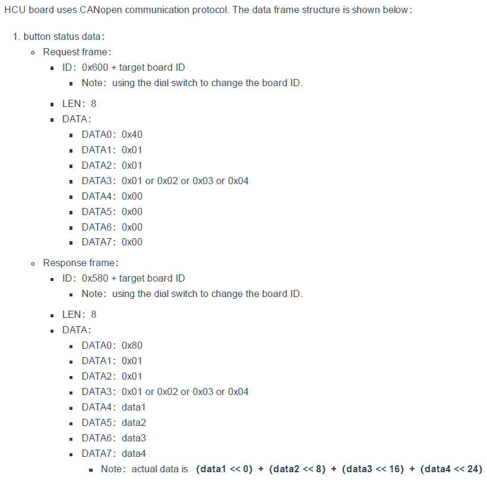

# CANopen Hardware

This section contains details about some of hardware used in the Fourier X2 Exoskeleton and how to interface with them using canopensocket.

## X2 CANopen Node ID

| Node ID             | Device                   |
| ------------------- |:------------------------:|
| 1                   | Left Hip Drive           |
| 2                   | Left Knee Drive          |
| 3                   | Right Hip Drive          |
| 4                   | Right Knee Drive         |
| 9                   | Hand Control Unit        |
| 11                  | Left Thigh Force Sensor  |
| 12                  | Left Calf Force Sensor   |
| 13                  | Right Thigh Force Sensor |
| 14                  | Right Calf Force Sensor  |
| 21                  | Left Foot Force Sensor   |
| 22                  | Right Foot Force Sensor  |

## X2 CANbus Cable Mapping
Currrently RJ45 ended cables are used to connect to the X2 CAN network. They have the following mapping.

| Ethernet Cable Wire | CAN                    |
| ------------------- |:----------------------:|
| Green               | CAN-L                  |
| White with Green    | CAN-H                  |
| White with Orange   | Signal Ground          |

## Hand Control Unit
The hand control unit (HCU) has 4 buttons connected to a custom board that supports some CANopen features. The image below shows the data frame for request and response for the HCU on the X2 (Obtained from the Fourier X2 Developer Guide). 

* The HCU is currently on CAN node 9.
* Using canopencomm, we can query button 1 using: `./canopencomm [1] 9 read 0x0101 1 u32`. 
* When pressed (and held),  the response is `[1] 0x3F800000`, else it is `[1] 0x00000000`.
* For button 2 change the index from `0x0101` to `0x0102`. For 3 use `0x0104`, and for 4, use `0x0104`.

Note: The steps above can also be done use CAN-utils as follows:

* `cansend can1 609#40.01.01.01.00.00.00.00` for button 1. 
* The response can be captured using candump. It is `589 [8] 43 01 01 01 00 00 00 00` when button not pressed. Otherwise it is `589 [8] 43 01 01 01 00 00 80 3F`.
* For button 2, use `cansend can1 609#40.02.01.01.00.00.00.00`.