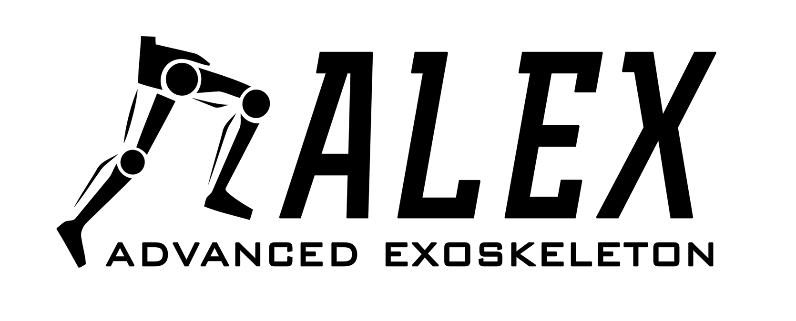

# ALEX Embedded System Documentation

---

You might find this website and documentation useful if you are:

- Developing on the Fourier X2 exoskeleton using a Beagle Bone Black (BBB)
- Developing an embedded system using a Beagle Bone Black as the hardware platform
- Implementing a real time linux system.
- Implementing CANopen on Linux running on the Beagle Bone Black
- Need detailed instructions to do any of the above
- more to come.

---

## Project Breakdown

The primary goal of this project is to improve capabilities of the X2 lower limb exoskeleton developed by [Fourier Intelligence](http://www.fftai.com/). Specifically, the intention is to:

* Successfully compete in [Cybathlon 2020](https://cybathlon.ethz.ch/cybathlon-2020.html) in Zurich.
* Develop an open platform that can be used by third parties to utilise and improve similar rehabilitative devices.
* Improve the X2, to make it more beneficial for individuals with paraplegia.

This website primarily focuses on the embedded system on the Fourier X2.

---

## Getting Started
This website is broadly divided into 3 section:

* Deployment: For instructions on how to run the system without going too much into the details. 
* Developer: Contains detailed information about recreating the work done in this project. 
* In-Development: This section contains work-in-progress information.

Below are steps for getting started with developing for the Fourier X2 exoskeleton. Depending on your goal, check either the deployment or developer section for details.

1. Set up a virtual machine workbench to cross compile and deploy on the BBB.
2. Set up connection from your PC to the BBB.
2. Install a RT kernel on the BBB. 
3. Setup the CANopenSocket on the BBB for CANopen communication to the X2.
4. Run appropriate scripts and programs as required. 