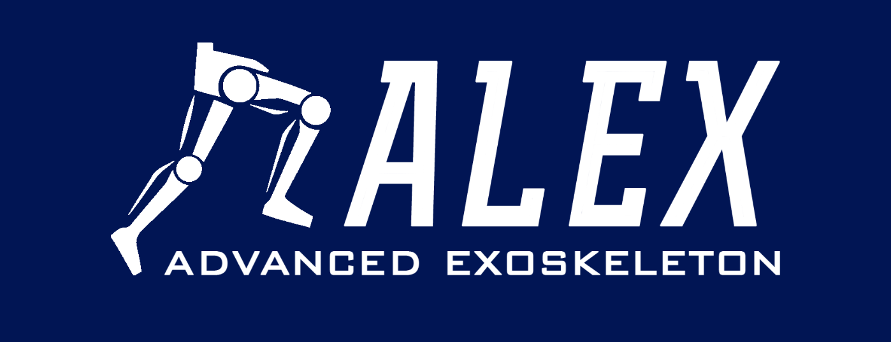

# Alex Embeded System Documentation



---

## You have just found ALEXs Embeded system docs

<!-- What alex is:

What the documentationon can tell you

Description of what the project is. -->

You might find the docs useful if you are:

- Developing on the Fourier inteligence platform using a beagle bone black
- Developing an embeded system using a begale bone black as the hardware platform
- Are in need of implementing a real time linux system.
- Are in need of impleneting a real time linux development system with Can Bus support
- Detailed instructions on implementing Can bus support over a beagle bone black.
- more to come.

---

## Project breakdown

---

<!--
    mkdocs.yml    # The configuration file.
    docs/
        index.md  # The documentation homepage.
        ...       # Other markdown pages, images and other files.

--- -->

## Getting started in 10 minutes with a local install

<!-- EXPLAIN HOW THE BELLOW WAS BUILT -->

For development we suggest using a virtual machine running debian linux.
Follow these steps to start running a pre-configured VM .ova file on your own machine.

1. Install [virtual box](<https://github.com/capstonealex/Embeded/wiki/Setting-Up-Local-Desktop-Workbench-(VM)>).
2. Download workbench.ova: Currently hosted at the capstone google drive: [workbench.ova](https://drive.google.com/drive/folders/1lCGyRpQLjKOnCXbs27e6w6VfofizSCC8)

   `Capstone Project - LOWER LIMB EXOSKELETON FOR GAIT ASSISTANCE\Embedded Team\Virtual Machines`

   Hosting for others tbt.

3) In Virtual box `file -> import appliance` and enter the path to the .ova file
4) Configure the environment.

   - Be sure to have more than 70mb of video ram allocated.

5) Make sure to select the `reinitialize the MAC address of all the network cards option`.

6) Start your system and install virtual box Guest additions.

### Guest additions

    - On the Virtual box menu Choose “Devices”->”Insert Guest Additions CD image…”

    - If this does not automatically run then follow the below code.

        ```linux
        user@debian:~$ su -
        root@debian:~# apt-get update
        root@debian:~# apt-get install build-essential module-assistant
        root@debian:~# m-a prepare
        root@debian:~# cd /media/cdrom
        root@debian:~# sh ./VBoxLinuxAdditions.run
        root@debian:~# reboot
        ```

<!--
7) Test debian w/ cross compiler from previous file -->

You should now have a cloned VM with working Debian and cross compilation to beagle bone or any other armhf devices.

#### `Tested on mac OSX 10.14 and Windows 10`

## Support

## Aim of the project

```

```
