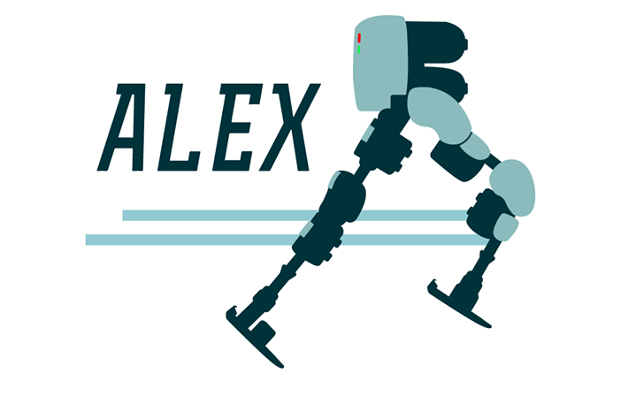

# ALEX Embedded System Documentation



---

## You have just found ALEX's embedded systems documentation

<!-- What alex is:

What the documentationon can tell you

Description of what the project is. -->

You might find the docs useful if you are:

- Developing on the Fourier inteligence platform using a beagle bone black
- Developing an embedded system using a begale bone black as the hardware platform
- Are in need of implementing a real time linux system.
- Are in need of impleneting a real time linux development system with Can Bus support
- Detailed instructions on implementing Can bus support over a beagle bone black.
- more to come.

---

## Project breakdown

---

## Getting started in 10 minutes with a local install

<!-- EXPLAIN HOW THE BELLOW WAS BUILT -->

For development we suggest using a virtual machine running debian linux.
Follow these steps to start running a pre-configured VM .ova file on your own machine.
The pre- congigured VM ha been configured as outlined in the [workbench setup] section.
Upon installation the user should be up and running with an environment able to develop software, test and cross compile to a real time linux os on a beagle bone black.

1. Install [VirtualBox version 6.0.4](<https://www.virtualbox.org/wiki/Download_Old_Builds_6_0>).
2. Install the [VirtualBox 6.0.4 Oracle VM VirtualBox Extension Pack](<https://www.virtualbox.org/wiki/Download_Old_Builds_6_0>).
2. Download workbench.ova: Currently hosted at the capstone google drive: [workbench.ova](https://drive.google.com/drive/folders/1lCGyRpQLjKOnCXbs27e6w6VfofizSCC8)

    * Google Drive Location: `Capstone Project - LOWER LIMB EXOSKELETON FOR GAIT ASSISTANCE\Embedded Team\Virtual Machines`
   Note: You may need a University of Melbourne email to access this link.

3. In Virtual box `file -> import appliance` and enter the path to the .ova file

4. Configure the environment .

    * Select 70mb or more of video ram.

5. Make sure to select the `reinitialize the MAC address of all the network cards option`. <!-- I didn't see this when I tried -->

6. Start your system and install virtual box Guest additions.

    * Login password is `password`

### Guest additions

On the Virtual box menu Choose “Devices”->”Insert Guest Additions CD image…”

If this does not automatically run then follow the below code on a terminal.

```
user@debian:~$ su -
root@debian:~# apt-get update
root@debian:~# apt-get install build-essential module-assistant
root@debian:~# m-a prepare
root@debian:~# cd /media/cdrom
root@debian:~# sh ./VBoxLinuxAdditions.run
root@debian:~# reboot
```
---
## Test system
* Follow the tests run in [cross compilation test](https://embeded.readthedocs.io/en/latest/crosscomp/#test-installation) section.
* Follow the instructions in [eclipse cross compilation](https://embeded.readthedocs.io/en/latest/eclipse/) section.
    
You should now have a cloned VM with working Debian and cross compilation to beagle bone or any other armhf devices.


#### `Tested on mac OSX 10.14 and Windows 10`

<!-- ## Support

## Aim of the project -->
